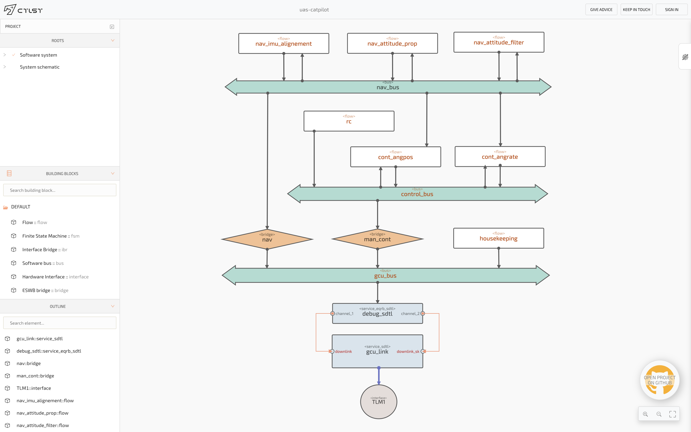
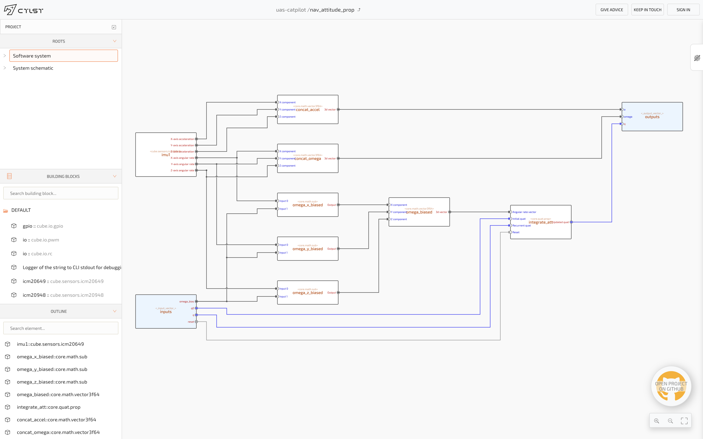
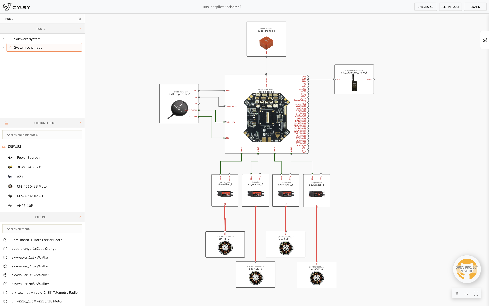
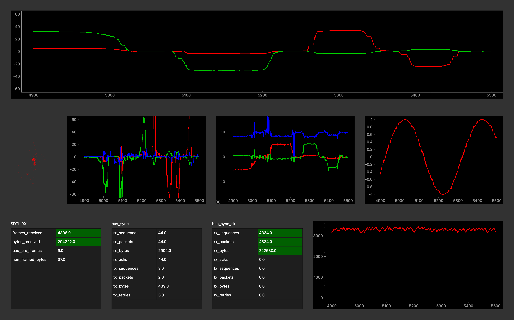
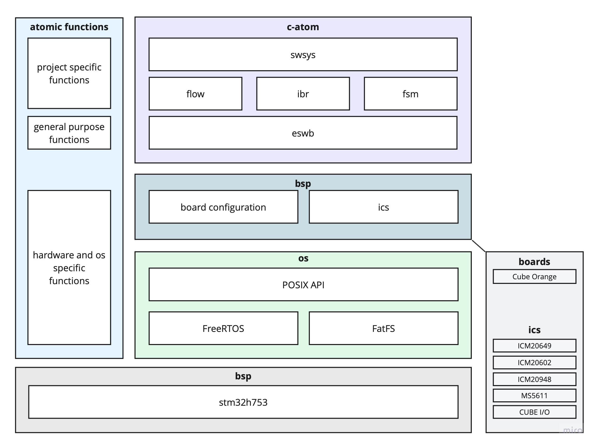

CatPilot is a drone's autopilot software stack designed to create scalable, distributed
embedded software systems.

CatPilot key idea is to use top-level domain-specific notations for specifying desired behavior. And
the minimalistic generalized C-language codebase to execute it for real-time mission-critical applications.

# Key features
- written in C language;
- extends via atomic functions - reusable blocks with supporting code generation from formal description;
- integrates to the specific vehicle by XML-shaped DSLs, which are orchestrated by model-based design tools;
- provides hardware and OS-agnostic stack that can easily migrate from one hardware to another while growing
  from prove-of-concept prototype to the certification grade solution;
- provides services for telemetry transmission, logging and visualization.

## Atomic functions

<details> 
<summary>1. Create formal representation</summary> 

```python

from fspeclib import *

Function(
    name='core.quat.prop',
    title=LocalizedString(
        en='Propagate quaternion'
    ),
    inputs=[
        Input(
            name='omega',
            title='Angular rate vector',
            value_type='core.type.v3f64'
        ),

        Input(
            name='q0',
            title='Initial quat',
            value_type='core.type.quat'
        ),

        Input(
            name='q',
            title='Recurrent quat',
            value_type='core.type.quat'
        ),

        Input(
            name='reset',
            title='Reset',
            description='Command for re-initializing output quat by q0',
            value_type='core.type.bool',
            mandatory=False
        ),
    ],
    outputs=[
        Output(
            name='q',
            title='Updated quat',
            value_type='core.type.quat'
        ),
    ],
    state=[
        Variable(
            name='inited',
            title='Initialized flag',
            value_type='core.type.bool'
        ),
    ],

    injection=Injection(
        timedelta=True
    )
)
```
</details>

<details>
<summary>2. Generate integration software and the implementation stub </summary>

Simply run:
```bash
fspecgen.py --code --cmake --f_specs_dirs project:./atomics/ catpilot:catpilot/atomics/ catom:catpilot/c-atom/atomics/
```
Check Manual for details [documentation](https://docs.ctlst.app/catom/atomic-functions.html) for details 
</details>

<details>
<summary>3. Implement behaviour</summary>

```c
#include "core_quat_prop.h"

void core_quat_prop_exec(
    const core_quat_prop_inputs_t *i,
    core_quat_prop_outputs_t *o,
    core_quat_prop_state_t *state,
    const core_quat_prop_injection_t *injection
)
{
    if (i->optional_inputs_flags.reset) {
        if (i->reset) {
            state->inited = 0;
        }
    }

    if (state->inited == FALSE) {
        o->q = i->q0;
        state->inited = 1;
    } else {
        o->q.w = i->q.w + -0.5 * ( i->q.x * i->omega.x + i->q.y * i->omega.y + i->q.z * i->omega.z ) * injection->dt;
        o->q.x = i->q.x +  0.5 * ( i->q.w * i->omega.x + i->q.y * i->omega.z - i->q.z * i->omega.y ) * injection->dt;
        o->q.y = i->q.y +  0.5 * ( i->q.w * i->omega.y + i->q.z * i->omega.x - i->q.x * i->omega.z ) * injection->dt;
        o->q.z = i->q.z +  0.5 * ( i->q.w * i->omega.z + i->q.x * i->omega.y - i->q.y * i->omega.x ) * injection->dt;
    }
}

```
</details>

<details>
<summary>4. Integrate and reuse easily</summary>

```xml
<f name="integrate_att" by_spec="core.quat.prop">
    <in alias="wx">omega_x/output</in>
    <in alias="wy">zero/output</in>
    <in alias="wz">zero/output</in>
    <in alias="q0">initial_euler/q</in>
    <in alias="q">norm_att_quat/q</in>
</f>
```
</details>

<details>
<summary>5. Check existing atomic functions catalog</summary>

[Catalog's link](https://docs.ctlst.app/atomics-catalog/catom-atomic-catalog.html)

</details>


## DSL based integration

Define top level behavior in the problem-oriented notation:

- **swsys** - software system description layer; allocates functions and other blocks into tasks and processes.
- **flow** - block to arrange computational graphs as a sequence of atomic reusable functions.
- **fsm** - finite state machine notation, operates by states, transitions and actions on states and transitions.
- **ibr** - interface bridge - designed to take care of converting information from and to other devices.

<details>
<summary>More info</summary>

[Documentation](https://docs.ctlst.app/catom/intro.html)

</details>


## Model-based design representation

View this GitHub project in [C-ATLAS](https://s1.ctlst.app/p/STGhxorC)

### Target's software system outlook


### Atomic function orchestration outlook


### Hardware integration outlook


## Quick control interfaces creation

Check [documentation](https://docs.ctlst.app/uas-catpilot/gui-creation.html) for more info




# Quick start and documentation

[Quick start manual](https://docs.ctlst.app/uas-catpilot/quick-start.html)

[Documentation](https://docs.ctlst.app/uas-catpilot/intro.html)

# Hardware support

CatPilot supports:
1. [CubePilot](https://www.cubepilot.com/) 
2. [Catalyst Aerospace Technologies devices family](https://ctlst.tech/catalog/)

# Project structure



This repository is created to collaborate on functions and configurations
for Unmanned Aerial Systems, while hardware and platform related software is implemented 
in [catpilot repo](https://github.com/ctlst-tech/catpilot). CatPilot relates on 
[C-ATOM](https://github.com/ctlst-tech/c-atom) library for its generic functionality.
Core platform-agnostic middleware is the 
[Embedded Software Bus (ESWB)](https://github.com/ctlst-tech/eswb) library.


The project intends to separate knowledge is well-defined related and easily reusable modules.

# How to contribute

1. Join [Discord](https://discord.gg/yn3fm8bjWU), ask questions, raise issues
2. Create UAS-specific or generic atomic functions
3. Extend the list of the supported hardware (by the way, C-ATOM is application agnostic embedded stack)
4. Help to make the documentation crystal clear by adjusting the text or highlighting grey spots and problems

# Join the community

[Discord group](https://discord.gg/yn3fm8bjWU)

[](https://discord.gg/yn3fm8bjWU)

# Follow the updates

- [Twitter](http://twitter.com/ctlst_tech)
- [LinkedIn](https://www.linkedin.com/company/ctlst-tech/)
